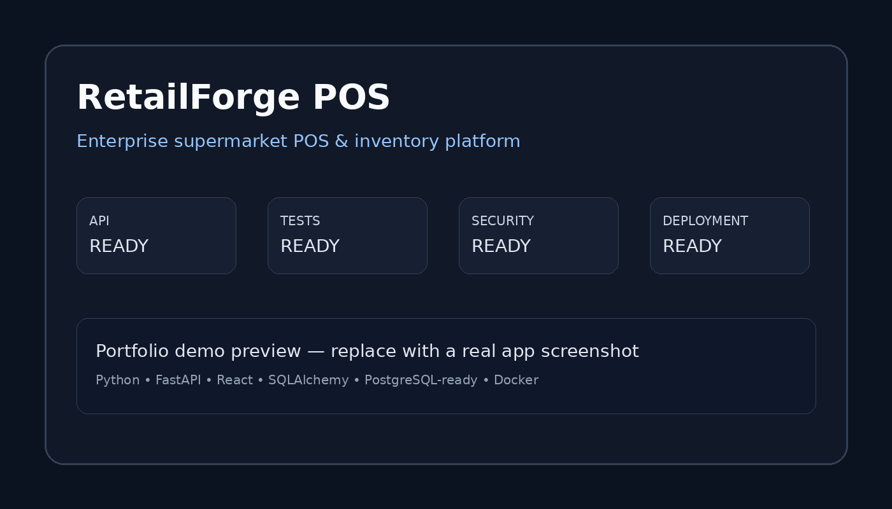

# RetailForge POS

> **Enterprise supermarket POS & inventory platform**


A production-style supermarket point-of-sale platform demonstrating full-stack engineering, inventory workflows, checkout, reporting, API design, testing, containerization, and CI.

**Portfolio value:** Ideal for retail, inventory, POS, ERP-lite, order management and internal operations clients.

## Tech stack

Python • FastAPI • React • SQLAlchemy • PostgreSQL-ready • Docker

## Key capabilities

- Production-oriented API boundaries and typed validation
- Automated testing and CI
- Environment-based configuration
- Security-focused repository automation
- Docker/cloud deployment path where appropriate
- Documentation written for developers and technical stakeholders

## Quick start

> These commands assume Python 3.12+ unless the project specifies otherwise.

```bash
python -m venv .venv
source .venv/bin/activate
pip install -r requirements.txt
```

Copy `.env.example` to `.env` and fill only the values required for your local environment.

### API documentation

When the API is running, open `/docs` for interactive OpenAPI documentation and `/redoc` for the alternative API reference.

## Testing

```bash
pytest -q
```

## Project structure

```text
├── app/ or src/          # application code
├── tests/                # automated tests
├── docs/                 # architecture, demo and deployment notes
├── data/                 # safe synthetic/demo data only
├── scripts/              # local setup/seed helpers
├── .github/workflows/    # CI and security automation
├── .env.example          # configuration template
└── README.md
```

## Architecture

See [`docs/architecture.md`](docs/architecture.md).

## Demo preview



This preview is a portfolio visual. Replace it with a real application screenshot after running the project locally; see [`docs/demo.md`](docs/demo.md).

## Production considerations

This repository is intentionally designed as a portfolio/reference implementation. Before production use, add environment-specific authentication, authorization, rate limiting, observability, secret management, backups, privacy controls and deployment-specific hardening.

## Security

See [`SECURITY.md`](SECURITY.md). Never commit credentials or production data.

## License

MIT. See [`LICENSE`](LICENSE).


## Client use cases

Ideal for retail, inventory, POS, ERP-lite, order management and internal operations clients.

## Disclaimer

This is a portfolio/reference project using synthetic or demonstration data. It is not presented as a deployed client system.
